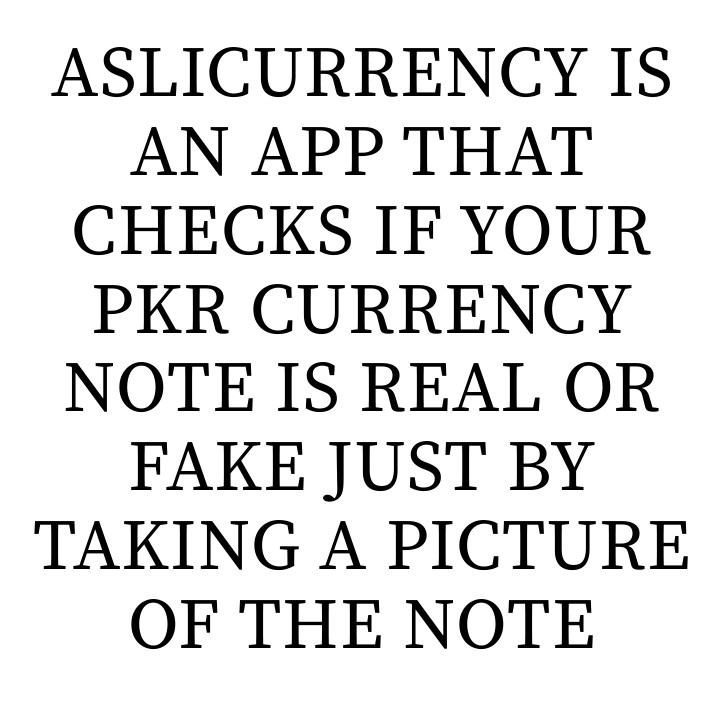
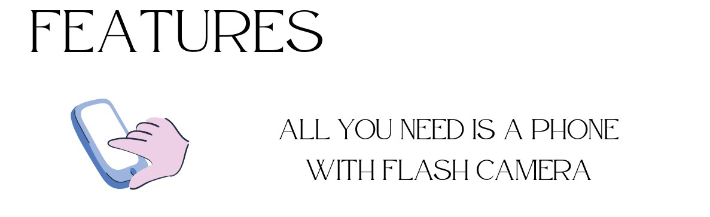
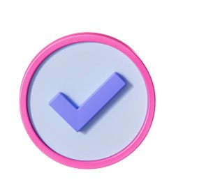
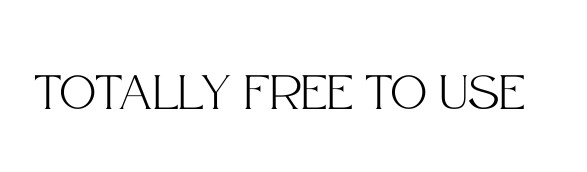
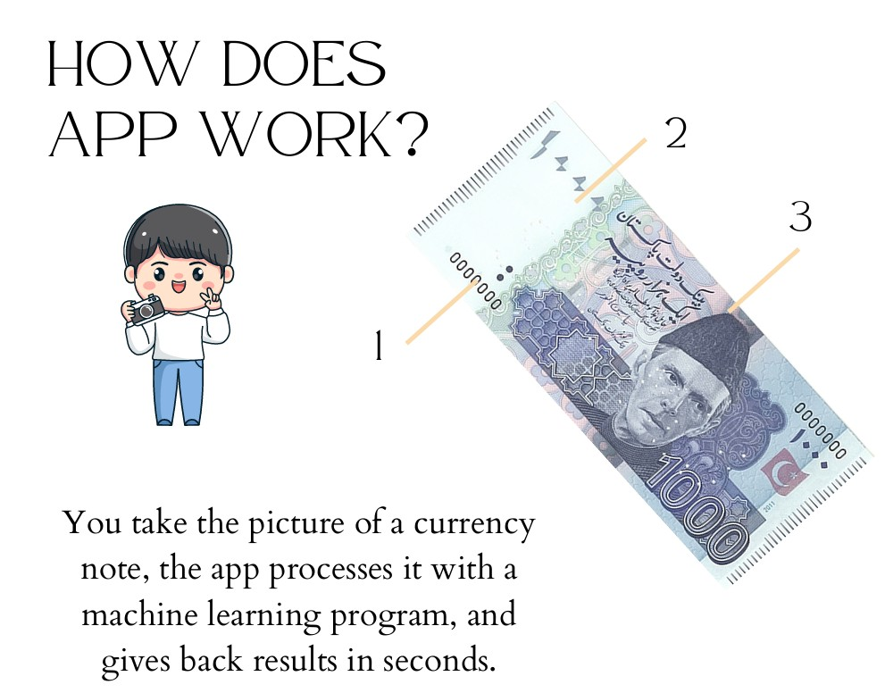
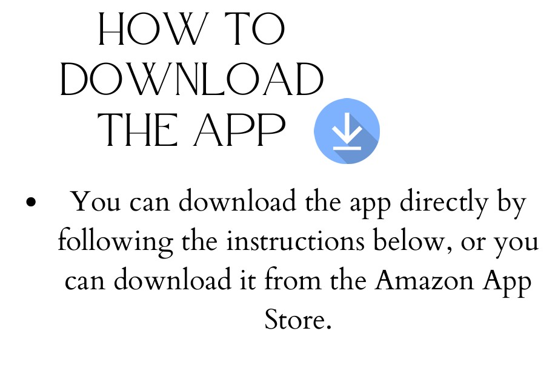
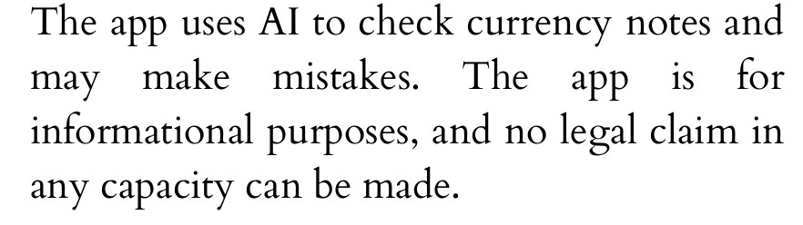
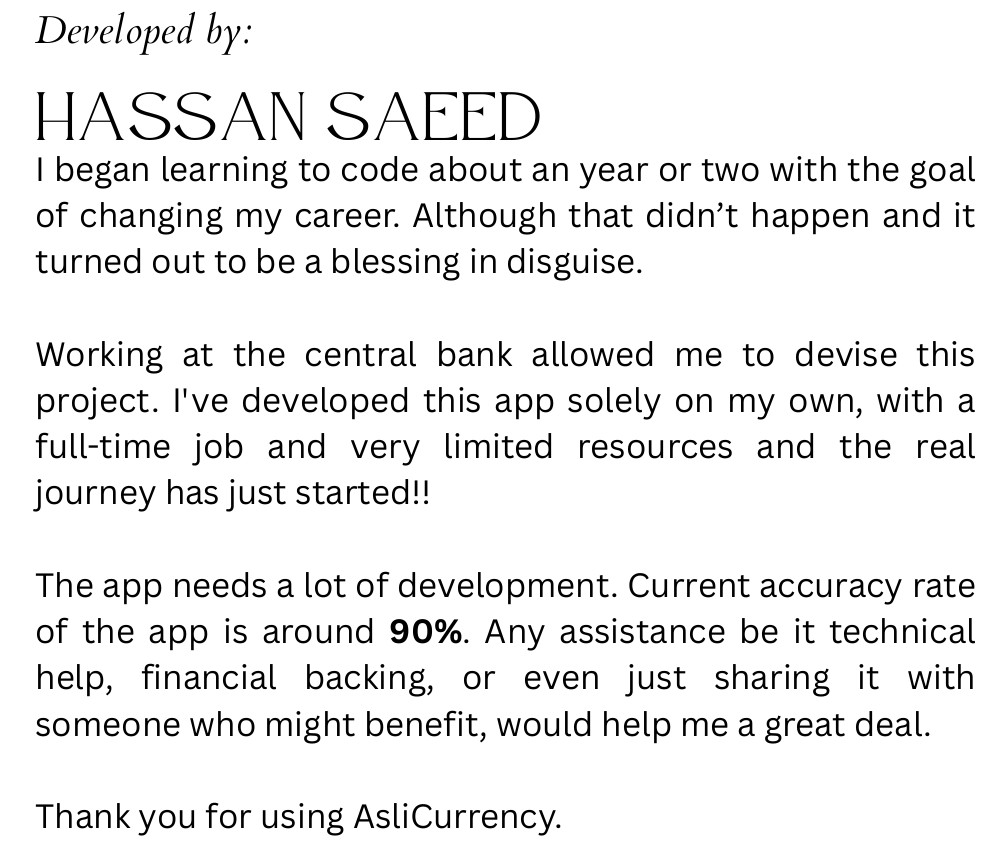
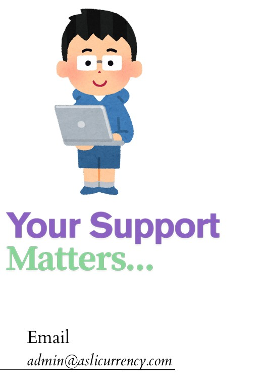

<!-- The three dashes above and below are required for Jekyll frontmatter -->

  
  
  
  
  
  
  
  
  
  

<ol class="steps">
  <li>When prompted, click "Enable installations from unknown sources."</li>
  <li>You can also manually enable it in your device settings: 
      <em>Settings → Security → Unknown sources</em>
  </li>
  <li>Once downloaded, open the APK file and follow the install prompts.</li>
</ol>

  <a class="button"
     href="https://github.com/nedge-developers/aslicurrency/releases/download/v2.0/Aslicurrency.apk"
     target="_blank" rel="noopener">
    Download AsliCurrency APP
  </a>

  
  
  
  

  <a href="privacy.html" class="link">Privacy Policy</a>

