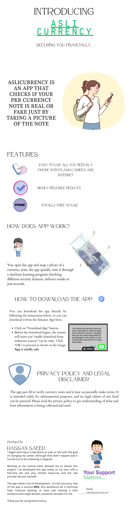

<html lang="en">
<head>
  <meta charset="UTF-8">
  <title>AsliCurrency</title>
  <meta name="viewport" content="width=device-width, initial-scale=1">
  <link rel="stylesheet" href="styles.css">
</head>
<body>
  <!-- Banners -->
  

    
  

  

  
  <!-- Download button -->
  

    <a class="button"
       href="https://github.com/nedge-developers/aslicurrency/releases/download/v2.0/Aslicurrency.apk"
       target="_blank" rel="noopener">
      Download AsliCurrency APP
    </a>
  

  
  <!-- More banners if needed -->
  
  <!-- Footer -->
   <a class="button"
       href= "aslicurrency/privacy.md"
       target="_blank" rel="noopener">
     Privacy Policy
    </a>
</body>
</html>
